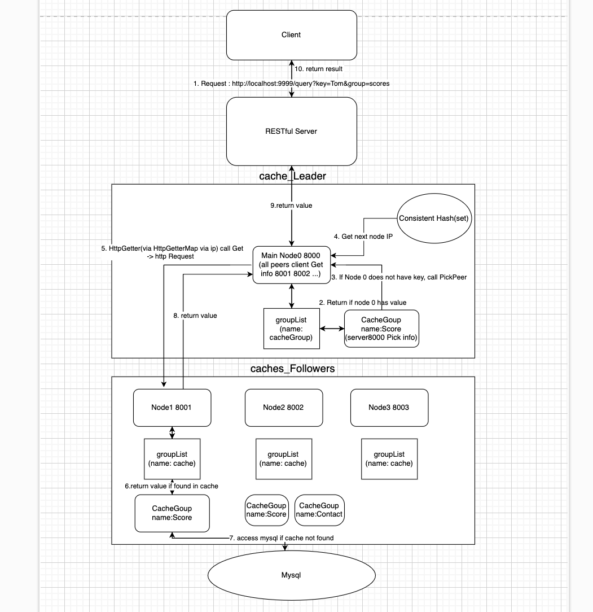

# GoGoCache

# Overview
GoGoCache is a distributed caching system implemented in Go, inspired by the design principles of groupcache, a Go version of memcached. The project covers various aspects of caching, including resource control, eviction policies, concurrency, and communication among distributed nodes.

# Features
Single-node Cache: GeeCache supports a standalone, in-memory cache.

HTTP-based Distributed Cache: The project extends to include a distributed cache accessible over HTTP.

LRU Eviction Strategy: Implements the Least Recently Used (LRU) cache eviction policy.

Concurrency Control: Utilizes Go's locking mechanisms to prevent cache stampedes.

Consistent Hashing: Employs consistent hashing for node selection to achieve load balancing.

Protobuf Communication: Optimizes binary communication between nodes using Protocol Buffers.

Data Retrieval: Retrieve data from MySQL in the event of a cache miss.

# Test
I created a simple test bash script to test cache system
~~~
$ ./test.sh
~~~
